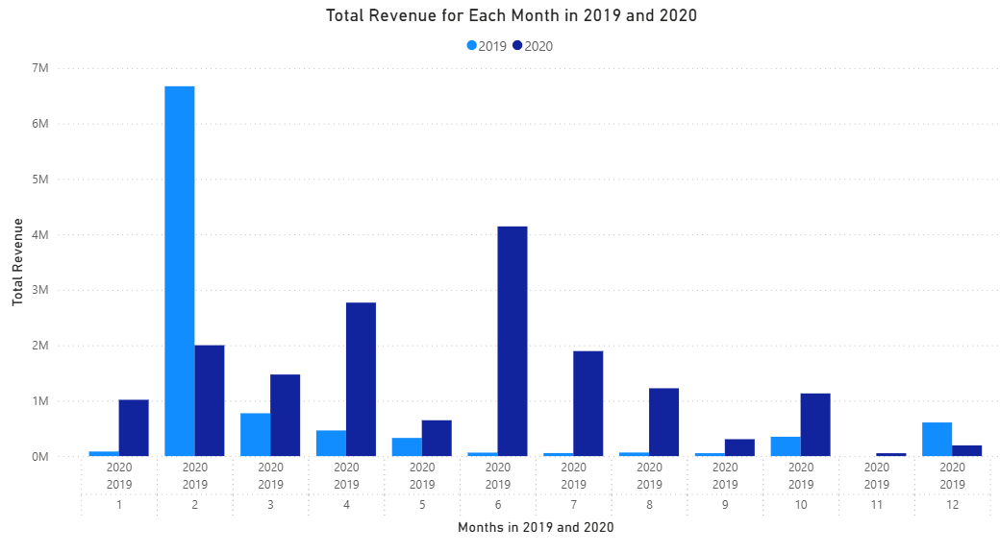

# Introduction
This project analyzes the business performance of a retail store over two years (2019–2020) using sales and customer transaction data. The goal is to understand revenue trends, product performance, and customer behavior, and to translate these insights into practical business recommendations.

# Executive Summary
This report address business trend of a store 

# Objectives

1. Analyze customer purchasing patterns and purchasing power.
2. Identify top-selling and high-growth products.
3. Evaluate revenue growth after new product additions.
4. Assess customer retention and value to the business.

# Data Overview

- **Data source** : [Kaggle](https://www.kaggle.com/datasets/sticktogethertm/business-analysis-junior)
- **Period**: 2019 and 2020
- **Tables**: One table per year
- **Key fields**: Order Number, Client ID, Product Code, Date of Delivery, Delivery Amount

# Limitations and Challenges
- The dataset covers only two years, which limits long-term trend analysis.
- A significant portion of records contained missing values.
- Removing rows with missing data may introduce bias, but was necessary to ensure data accuracy.

# Data Cleaning
For this dataset, there were several cleaning steps that was done.

- **Missing data** : Removed rows with missing critical fields
- **Redundancies** : Eliminated duplicate records
- **Datatype** : Converted data types to ensure accurate calculations and analysis

# Analysis
## 1. Total Earning Comparison (2019 and 2020)

```sql
WITH year19 as (
    SELECT 
        product_code,
        SUM(delivery_amount) as total_amount
    FROM cleaned2019
    WHERE order_number is not null
    GROUP BY product_code
), year20 as (
    SELECT
        product_code,
        SUM(delivery_amount) as total_amount
    FROM cleaned2020
    WHERE order_number is not null
    GROUP BY product_code
)
SELECT
    b.product_code,
    b.total_amount as earning_2020,
    a.total_amount as earning_2019,
    ABS(b.total_amount - a.total_amount) as difference,
    sum(ABS(b.total_amount - a.total_amount)) over()
FROM year20 b 
LEFT JOIN year19 a
    on a.product_code = b.product_code
WHERE a.product_code is not NULL
```


- Total store revenue increased by approximately RM7 million in 2020.
- Some products from 2019 were discontinued, while new products were introduced in 2020.
- Despite product changes, overall revenue growth remained strong.

## 2. Product with the Highest Increase in Earning

```sql
WITH year19 as (
    SELECT 
        product_code,
        SUM(delivery_amount) as total_amount
    FROM cleaned2019
    WHERE order_number is not null
    GROUP BY product_code
), year20 as (
    SELECT
        product_code,
        SUM(delivery_amount) as total_amount
    FROM cleaned2020
    WHERE order_number is not null
    GROUP BY product_code
)
SELECT
    b.product_code,
    b.total_amount as earning_2020,
    a.total_amount as earning_2019,
    ABS(b.total_amount - a.total_amount) as difference,
    sum(ABS(b.total_amount - a.total_amount)) over() AS overall_difference
FROM year20 b 
LEFT JOIN year19 a
    on a.product_code = b.product_code
```


- A small number of products showed significant revenue growth.
- Four products recorded a significant increase of more than RM700,000 each.
- Revenue growth was driven mainly by these high-performing products.

## 3. ABC Analysis
To identify which products generate the highest revenue and how important they are to the business. These products were categorised into three groups:

- A group : Products that generate the top 80% of the revenue to the store.
- B group : Products that generate the next 15% of the revenue to the store.
- C group : Products that generate the last 5% of the revenue to the store.

```sql
WITH year19 as (
    SELECT 
        product_code,
        SUM(delivery_amount) as total_amount
    FROM cleaned2019
    WHERE order_number is not null
    GROUP BY product_code
), year20 as (
    SELECT
        product_code,
        SUM(delivery_amount) as total_amount
    FROM cleaned2020
    WHERE order_number is not null
    GROUP BY product_code
), cumulative AS (
SELECT
    b.product_code,
    b.total_amount + a.total_amount as revenue,
    SUM(b.total_amount + a.total_amount) OVER () AS total_revenue,
    SUM(b.total_amount + a.total_amount) OVER (ORDER BY b.total_amount + a.total_amount DESC
        ROWS BETWEEN UNBOUNDED PRECEDING AND CURRENT ROW) as cum_revenue
FROM year20 b 
LEFT JOIN year19 a
    on a.product_code = b.product_code
WHERE a.product_code is not NULL
), abc_group AS (
SELECT
    *,
    cum_revenue / total_revenue as percentage,
    CASE
        WHEN cum_revenue / total_revenue <= 0.80 THEN 'A'
        WHEN cum_revenue / total_revenue <=0.95 THEN 'B'
        ELSE 'C' 
    END AS group_type
FROM cumulative
)
SELECT 
    group_type,
    COUNT(product_code) AS number_of_product,
    SUM(revenue) as revenue
FROM abc_group
GROUP BY group_type
```


| Group       | Number of Products|
|--------------|-----------------|
| A           | 42            |
| B           | 36            |
| C           | 43            |

Even though the number of products in group C is higher than group A, it generates signicantly lower revenue. This shows that the number of products does not have any influence on how much revenue was generated.

## 4. Customer Revenue Growth in 2020

```sql
WITH year19 as (
    SELECT 
        client_id,
        product_code,
        SUM(delivery_amount) as total_amount
    FROM cleaned2019
    WHERE order_number is not null
    GROUP BY client_id, product_code
), year20 as (
    SELECT
        client_id,
        product_code,
        SUM(delivery_amount) as total_amount
    FROM cleaned2020
    WHERE order_number is not null
    GROUP BY client_id, product_code
)
SELECT
    COALESCE(a.client_id, b.client_id) AS client_id,
    COALESCE(b.total_amount, 0) - COALESCE(a.total_amount, 0) AS revenue_growth,
    SUM(COALESCE(b.total_amount, 0) - COALESCE(a.total_amount, 0)) OVER() AS total_growth
FROM year19 a
FULL OUTER JOIN year20 b
    ON a.client_id = b.client_id
--WHERE a.product_code IS NOT NULL 
 -- and b.product_code is not null
ORDER BY revenue_growth DESC
```


- Most customers increased their spending from 2019 to 2020.
- Some customers showed a decline, but overall customer revenue grew by over 70%.
- This suggests strong customer retention and increased purchasing activity.

## 5. RFM Analysis
RFM analysis (Recency, Frequency, Monetary Value) is a customer segmentation technique that scores customers based on how recently they bought, how often they buy, and how much they spend.

- Recency (R): The most recent purchase made by customer.
- Frequency (F): Frequency of customer make their purchase.
- Monetary Value (M): Customers' spending amount.

```sql
WITH year19 as (
    SELECT 
        client_id,
        date_of_delivery,
        order_number,
        product_code,
        delivery_amount
    FROM cleaned2019
    WHERE order_number is not null
), year20 as (
    SELECT
        client_id,
        date_of_delivery,
        order_number,
        product_code,
        delivery_amount
    FROM cleaned2020
    WHERE order_number is not null
), recency AS (
    SELECT
        client_id,
        MAX(date_of_delivery) AS latest_delivery
    FROM (
        SELECT client_id, date_of_delivery FROM year19
        UNION ALL
        SELECT client_id, date_of_delivery FROM year20
    ) t
    GROUP BY client_id
), frequency AS (
    SELECT
        client_id,
        COUNT(DISTINCT order_number) AS total_orders
    FROM (
        SELECT client_id, order_number FROM year19
        UNION ALL
        SELECT client_id, order_number FROM year20
    ) t
    GROUP BY client_id
), monetary AS (
    SELECT
        client_id,
        SUM(delivery_amount) AS total_revenue
    FROM (
        SELECT client_id, delivery_amount FROM year19
        UNION ALL
        SELECT client_id, delivery_amount FROM year20
    ) t
    GROUP BY client_id
)
SELECT
    r.client_id,
    r.latest_delivery,        -- Recency
    f.total_orders,           -- Frequency
    m.total_revenue           -- Monetary
FROM recency r
LEFT JOIN frequency f
    ON r.client_id = f.client_id
LEFT JOIN monetary m
    ON r.client_id = m.client_id
ORDER BY r.latest_delivery DESC;
```


- Recency: All customers made their most recent purchases in 2020.
- Frequency: Customers with more orders generated higher revenue.
- Monetary: Total spending increases linearly with purchase frequency.
- Frequent customers are the most valuable to the business.

## 6. Seasonality

```sql
WITH year19 as (
    SELECT 
        client_id,
        date_of_delivery,
        order_number,
        product_code,
        delivery_amount
    FROM cleaned2019
    WHERE order_number is not null  and date_of_delivery is not null
), year20 as (
    SELECT
        client_id,
        date_of_delivery,
        order_number,
        product_code,
        delivery_amount
    FROM cleaned2020
    WHERE order_number is not null  and date_of_delivery is not null
), monthly_revenue as (
    SELECT
        extract(MONTH FROM date_of_delivery) as months,
        EXTRACT(YEAR FROM date_of_delivery) as years,
        SUM(delivery_amount) as delivery_amount
    FROM 
        (SELECT date_of_delivery, delivery_amount FROM year19
        UNION ALL 
        SELECT date_of_delivery, delivery_amount FROM year20
        )
    GROUP BY months, years
    ORDER BY years, months
)
SELECT
    months,
    AVG(delivery_amount) as avg_monthly
from monthly_revenue
group by months
ORDER BY avg_monthly DESC
```



- No strong seasonal pattern was observed across the year.
- November consistently recorded the lowest average revenue.
- Sales performance is relatively stable throughout most months.

# Findings

1. The store experienced strong revenue growth between 2019 and 2020.
2. Revenue is highly concentrated in a small number of top-performing products.
3. Customer retention is strong, with most customers increasing their spending.
4. Purchase frequency is a key driver of customer value.
5. There is minimal seasonality impact, except for weaker performance in November.

# Recommendations

1. Focus marketing and inventory planning on Group A products.
2. Promote products with the highest revenue growth more aggressively.
3. Implement loyalty or retention programs to encourage repeat purchases.
4. Introduce targeted promotions in November to improve low-month performance.
5. Continue improving data collection to support long-term trend analysis.

# Conclusion

This analysis shows that business growth is driven by a small number of high-performing products and loyal, repeat customers. By prioritizing these products, strengthening customer retention strategies, and addressing weaker periods, the store can sustain and further improve its overall performance. This project demonstrates how data-driven analysis can support effective business decision-making.

