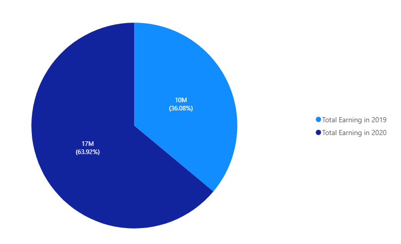
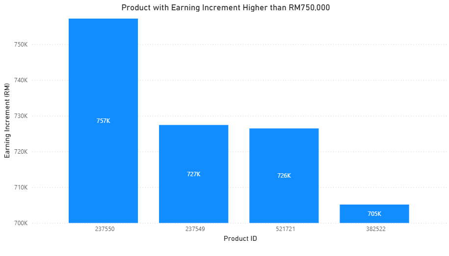
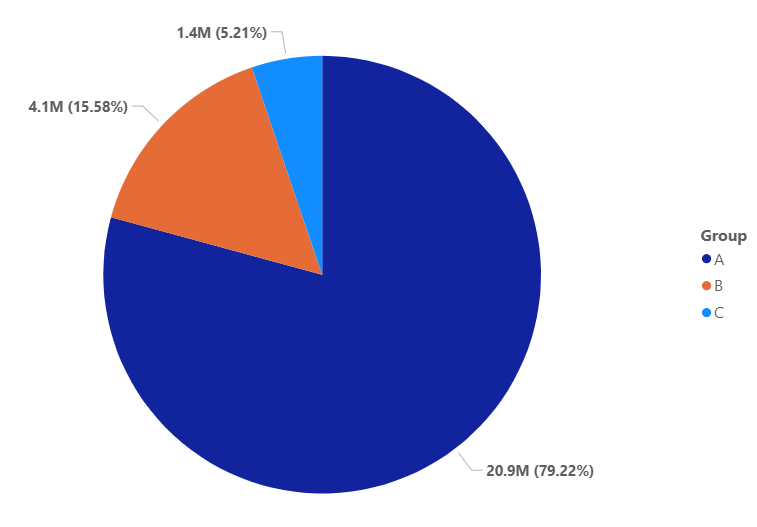
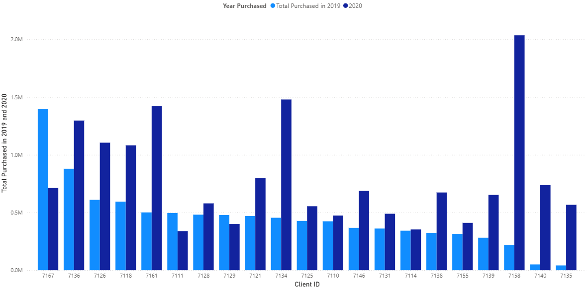
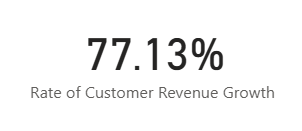
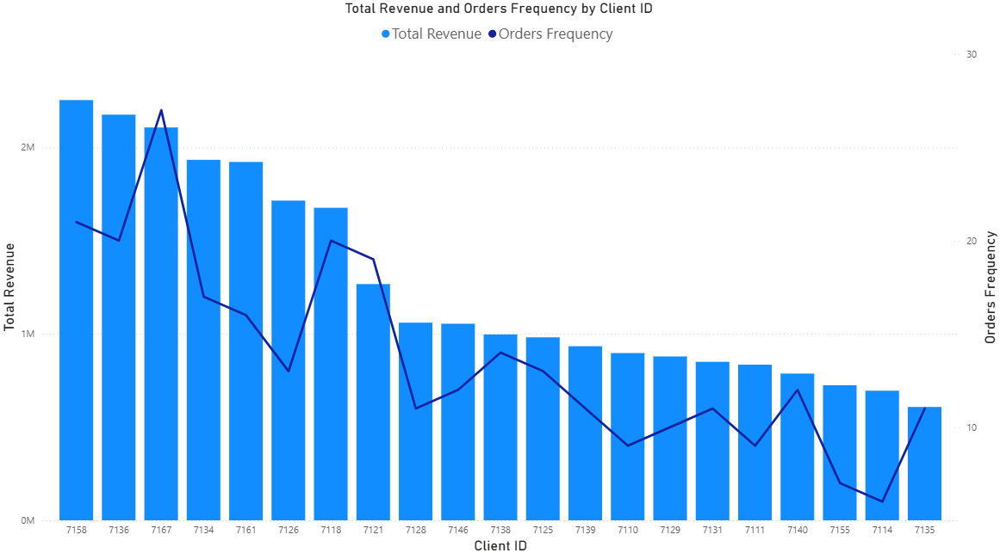

# Introduction
This project was conducted to analyse the business trend of a store throughout two years of its operation (2019-2020). This project contains two dataset of each respective year.

# Executive Summary
This report address business trend of a store 

# Objectives

1. To investigate the client purchasing power/pattern
2. To see top selling product to improve marketing for those product
3. To see growth of seller's revenue after the addition  of product  to the store
4. To see customer retention value to the store

# Data Overview

- **Data source** : [Kaggle](https://www.kaggle.com/datasets/sticktogethertm/business-analysis-junior)
- **Data size** : This dataset contains of two tables for each the year 0f 2019 and 2020 respectively. For each table, it collects the Order Number, Client ID, Product Code, Date of Delivery and Delivery Amount
- **Limitations and challenge** : Data collected for only two years, thus make it not enough to study the trend throughout the years of store operation. A huge part of data were missing from the columns, making it possibly bias (?)

# Data Cleaning
For this dataset, there were several cleaning steps that was done.

- **Missing data** : Since for the most part of missing data, only one column data is available, all rows with missing data were deleted.
- **Redundancies** : All redundant data were eliminated
- **Datatype** : Upon checking the data, datatype conversion were done for further analysis and calculation

# Analysis
## 1. Total Earning in 2020 in Comparison with 2019
To identify the total earning in 2020, I create a table that shows earning for each product for both year. Then, I sum the total earning.

```sql
WITH year19 as (
    SELECT 
        product_code,
        SUM(delivery_amount) as total_amount
    FROM cleaned2019
    WHERE order_number is not null
    GROUP BY product_code
), year20 as (
    SELECT
        product_code,
        SUM(delivery_amount) as total_amount
    FROM cleaned2020
    WHERE order_number is not null
    GROUP BY product_code
)
SELECT
    b.product_code,
    b.total_amount as earning_2020,
    a.total_amount as earning_2019,
    ABS(b.total_amount - a.total_amount) as difference,
    sum(ABS(b.total_amount - a.total_amount)) over()
FROM year20 b 
LEFT JOIN year19 a
    on a.product_code = b.product_code
WHERE a.product_code is not NULL
```



As shown in the diagram above, total earning of the store increase with 7 million ringgit from 2019 to 2020. It is also important to note that some product in 2019 were discontinued and there were some additional 
new product in 2020. 

## 2. Product with the Highest Increase in Earning
To identify product with highest increase in earning for future marketing strategy.

```sql
WITH year19 as (
    SELECT 
        product_code,
        SUM(delivery_amount) as total_amount
    FROM cleaned2019
    WHERE order_number is not null
    GROUP BY product_code
), year20 as (
    SELECT
        product_code,
        SUM(delivery_amount) as total_amount
    FROM cleaned2020
    WHERE order_number is not null
    GROUP BY product_code
)
SELECT
    b.product_code,
    b.total_amount as earning_2020,
    a.total_amount as earning_2019,
    ABS(b.total_amount - a.total_amount) as difference,
    sum(ABS(b.total_amount - a.total_amount)) over() AS overall_difference
FROM year20 b 
LEFT JOIN year19 a
    on a.product_code = b.product_code
```



These 4 have the most notable increment in earning, which has increment higher than RM750,000.

## 3. ABC Analysis
To identify which products generate the highest revenue and how important they are to the business. Grouping into three groups; A, B and C group.

- A group : Very Important. Generate the top 80% of the revenue to the store.
- B group : Medium Important. Generate the next 15% of the revenue to the store.
- C group : Least Important. Generate the last 5% of the revenue to the store.

```sql
WITH year19 as (
    SELECT 
        product_code,
        SUM(delivery_amount) as total_amount
    FROM cleaned2019
    WHERE order_number is not null
    GROUP BY product_code
), year20 as (
    SELECT
        product_code,
        SUM(delivery_amount) as total_amount
    FROM cleaned2020
    WHERE order_number is not null
    GROUP BY product_code
), cumulative AS (
SELECT
    b.product_code,
    b.total_amount + a.total_amount as revenue,
    SUM(b.total_amount + a.total_amount) OVER () AS total_revenue,
    SUM(b.total_amount + a.total_amount) OVER (ORDER BY b.total_amount + a.total_amount DESC
        ROWS BETWEEN UNBOUNDED PRECEDING AND CURRENT ROW) as cum_revenue
FROM year20 b 
LEFT JOIN year19 a
    on a.product_code = b.product_code
WHERE a.product_code is not NULL
), abc_group AS (
SELECT
    *,
    cum_revenue / total_revenue as percentage,
    CASE
        WHEN cum_revenue / total_revenue <= 0.80 THEN 'A'
        WHEN cum_revenue / total_revenue <=0.95 THEN 'B'
        ELSE 'C' 
    END AS group_type
FROM cumulative
)
SELECT 
    group_type,
    COUNT(product_code) AS number_of_product,
    SUM(revenue) as revenue
FROM abc_group
GROUP BY group_type
```



## 4. Customer Revenue Growth in 2020
This is to study each customer revenue growth from 2019 to 2020.

```sql
WITH year19 as (
    SELECT 
        client_id,
        product_code,
        SUM(delivery_amount) as total_amount
    FROM cleaned2019
    WHERE order_number is not null
    GROUP BY client_id, product_code
), year20 as (
    SELECT
        client_id,
        product_code,
        SUM(delivery_amount) as total_amount
    FROM cleaned2020
    WHERE order_number is not null
    GROUP BY client_id, product_code
)
SELECT
    COALESCE(a.client_id, b.client_id) AS client_id,
    COALESCE(b.total_amount, 0) - COALESCE(a.total_amount, 0) AS revenue_growth,
    SUM(COALESCE(b.total_amount, 0) - COALESCE(a.total_amount, 0)) OVER() AS total_growth
FROM year19 a
FULL OUTER JOIN year20 b
    ON a.client_id = b.client_id
--WHERE a.product_code IS NOT NULL 
 -- and b.product_code is not null
ORDER BY revenue_growth DESC
```





For most of customer, there are growth in their purchasing while for some others there are decline in their purchasing. However, for overall customer revenue growth, we see a quite significant growth with more than 70% increase.

## 5. RFM Analysis
RFM analysis (Recency, Frequency, Monetary Value) is a customer segmentation technique that scores customers based on how recently they bought, how often they buy, and how much they spend.

- Recency (R): The most recent purchase made by customer.
- Frequency (F): Frequency of customer make their purchase.
- Monetary Value (M): Customers' spending amount.

```sql
WITH year19 as (
    SELECT 
        client_id,
        date_of_delivery,
        order_number,
        product_code,
        delivery_amount
    FROM cleaned2019
    WHERE order_number is not null
), year20 as (
    SELECT
        client_id,
        date_of_delivery,
        order_number,
        product_code,
        delivery_amount
    FROM cleaned2020
    WHERE order_number is not null
), recency AS (
    SELECT
        client_id,
        MAX(date_of_delivery) AS latest_delivery
    FROM (
        SELECT client_id, date_of_delivery FROM year19
        UNION ALL
        SELECT client_id, date_of_delivery FROM year20
    ) t
    GROUP BY client_id
), frequency AS (
    SELECT
        client_id,
        COUNT(DISTINCT order_number) AS total_orders
    FROM (
        SELECT client_id, order_number FROM year19
        UNION ALL
        SELECT client_id, order_number FROM year20
    ) t
    GROUP BY client_id
), monetary AS (
    SELECT
        client_id,
        SUM(delivery_amount) AS total_revenue
    FROM (
        SELECT client_id, delivery_amount FROM year19
        UNION ALL
        SELECT client_id, delivery_amount FROM year20
    ) t
    GROUP BY client_id
)
SELECT
    r.client_id,
    r.latest_delivery,        -- Recency
    f.total_orders,           -- Frequency
    m.total_revenue           -- Monetary
FROM recency r
LEFT JOIN frequency f
    ON r.client_id = f.client_id
LEFT JOIN monetary m
    ON r.client_id = m.client_id
ORDER BY r.latest_delivery DESC;
```




As seen above, the revenue generates from each customer is linear with the number of orders made by customer. All latest purchased made by customers also in 2020.

## 6. Seasonality
This is to see if there are any seasonality based on the pattern on how much the store earn for each month in both 2019 and 2020. 


